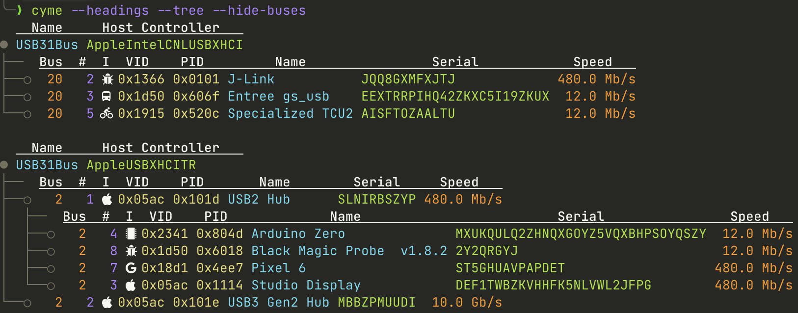

```
           o
      o   /---o
     /---/---o
o---/
     \---\---o
      o   \---o
            o
```
# Cyme

[](https://crates.io/crates/cyme)
[](https://docs.rs/cyme/latest/cyme/)

List system USB buses and devices; a modern `lsusb` that attempts to maintain compatibility with, but also add new features. Includes a macOS `system_profiler SPUSBDataType` parser module and libusb tool for non-macOS systems/gathering more verbose information.

The project started as a quick replacement for the barely working [lsusb script](https://github.com/jlhonora/lsusb) and is my _yearly_ Rust project to keep up to date! It is currently in flux as I build the foundations, learn about custom serde Deserializers and newer Rust features.

The name comes from the technical term for the type of blossom on a Apple tree: [cyme](https://en.wikipedia.org/wiki/Inflorescence#Determinate_or_cymose) - it is Apple related and also looks like a USB device tree 😃🌸.



# Features

* Compatible with `lsusb` using `--lsusb` argument. Supports all arguments including `--verbose` output using libusb. Output is indentical for use with no args (list), almost matching for tree (driver port number not included) and near match for verbose.
* Filters like `lsusb` but that also work when printing `--tree`. Adds `--filter_name`, `--filter_serial` and option to hide empty `--hide-buses`/`--hide-hubs`.
* Improved `--tree` mode; shows device, configurations, interfaces and endpoints as tree depending on level of `--verbose`.
* Modern terminal features with coloured output, utf-8 characters and icons. Can be turned off and customised.
* Can be used as a library too with `system_profiler` parsing module, `lsusb` module using libusb and `display` module for printing amoungst others.
* `--json` output that honours filters and `--tree`.
* Targets for Linux, macOS, perhaps Windows...

## Planned Features for 1.0.0 Release

- [x] Controllable block data like `lsd --blocks`
- [x] Modern drawing of device tree with utf-8 boxes.
- [x] Nerd font icon look up and icon theming like `lsd --icon`.
- [x] libusb optional to get more USB data and support other OS with switch from `system_profiler`.
- [x] Group by in list mode.
- [x] udev support on Linux to get device driver etc.
- [x] Interface and Device Descriptor icon look up.
- [x] Drawing of headers.
- [x] Tree support of all device interfaces and endpoints.
- [x] --device devpath arg to dump single device.
- [x] Merge of macOS `system_profiler` output with libusb output to keep non-user Apple buses.
- [x] Integration tests for lsusb output.
- [ ] Integration tests for internal bin operation.
- [ ] User defined icon map and colour import.

# Install

For pre-compiled binaries, see the [releases](https://github.com/tuna-f1sh/cyme/releases).

From crates.io with a Rust tool-chain installed: `cargo install cyme`. If wishing to do it from within a local clone: `cargo install --path .`.

If wishing to use only macOS `system_profiler` and not obtain more verbose information, remove the 'libusb' feature with `cargo install --no-default-features cyme`

I also have a Homebrew tap, which will also install a man page and completions: 

```
brew tap tuna-f1sh/cyme
brew install cyme
```

## Linux udev

To obtain device and interface drivers being used on Linux like `lsusb`, one must install 'libudev-dev' via a package manager and the `--features udev` feature when building. Only supported on Linux targets.

## Alias `lsusb`

If one wishes to create a macOS version of lsusb or just use this instead, create an alias one's environment with the `--lsusb` compatibility flag:

`alias lsusb='cyme --lsusb'`

# Usage

Will cover this more as it develops. Use `cyme --help` for basic usage or `man ./doc/cyme.1`.

For usage as a library, the crate is 100% documented so look at [docs.rs](https://docs.rs/cyme/latest/cyme/)
